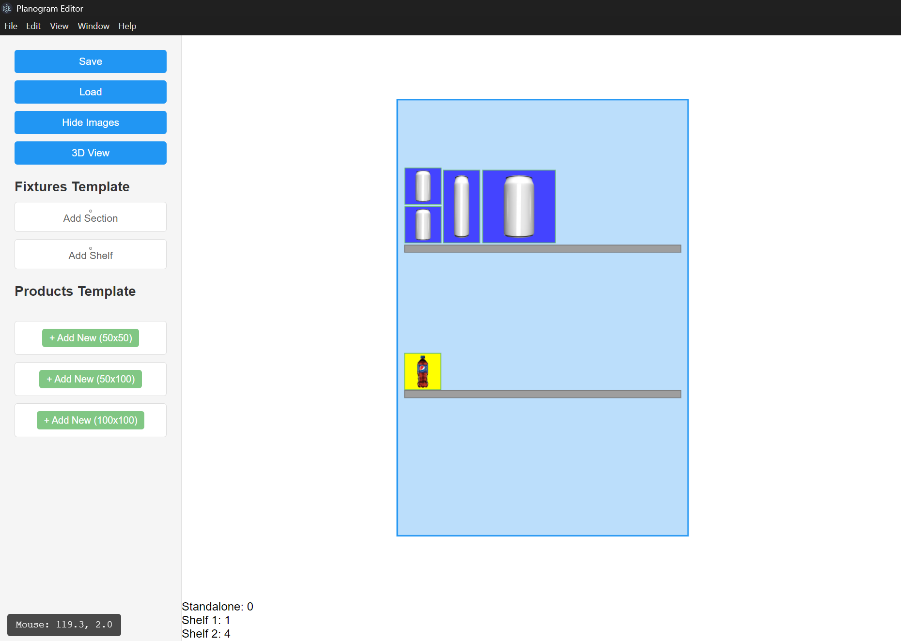
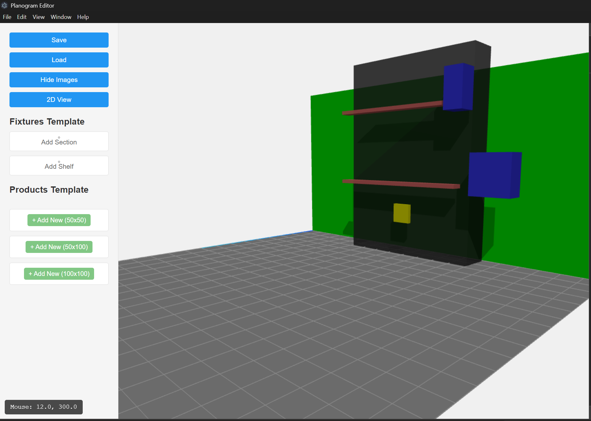

# Planogram Editor




A desktop application for creating and editing retail planograms with 2D visualization capabilities.

## 🚀 Tech Stack

- **Frontend**: 
  - Vue 3 (Composition API)
  - TypeScript
  - Electron (Desktop wrapper)
- **2D Visualization**:
  - Konva.js (Canvas rendering)
  - Vue-Konva (Vue integration)
- **3D View**:
  - Three.js
- **State Management**:
  - Pinia (Vue store)
- **Build Tools**:
  - Vite
  - npm scripts

## 📌 Key Features

- Drag-and-drop interface for retail components ✅
  - Add Product Template Use Button ✅
  - Add Fixture Template Use Button ✅
  - ~~Add Product or Fixture use Drag and Drop~~
- Real-time 2D visualization of store layouts ✅
- Section/Shelf/Product hierarchy management ✅
- Collision detection ✅
- Debug overlay with coordinate tracking ✅
- Electron-based desktop deployment ✅
- Use Shortcut to add facing product (ctrl+shift+arrow) ✅
- Load and Save Feature ✅
- Toggle Live Image ✅
- Select Node Indicator ✅
- ~~Copy, Cut, Paste and~~ Delete Object ✅
- Multiple Product Size ✅ 
- Product Properties 👷‍♂️
  - Set Color ✅ 
  - Open Product Properties
  - Add Depth 👷‍♂️
- Select Products Behaviour 
  - Double clicking will show properties
  - When click will select object within same type/subcategory
  - Blink-ing objets
- Layout
  - Add right section for properties
  - Add bottom bar to show info 
- 3D View 👷‍♂️
- Framework 
  - Vite enhancement ✅
  - Pinia enhancement

## 📦 Installation

1. **Prerequisites**:
   - Node.js v16+
   - npm v8+

2. **Clone repository**:
   ```bash
   git clone https://github.com/darfattt/planogram-editor.git
   cd planogram-editor
   ```

3. **Install dependencies**:
   ```bash
   npm install
   ```

## 🖥️ Running the Application

**Development mode**:
```bash
npm run electron:serve
```

**Production build**:
```bash
npm run electron:build
```

## 📂 Project Structure

```
planogram-editor/
├─ src/
│  ├─ components/       # Vue components
│  ├─ composables/      # Shared logic
│  ├─ types/            # TypeScript definitions
│  ├─ App.vue           # Root component
│  └─ main.ts           # Entry point
├─ electron/            # Electron configuration
├─ vite.config.ts       # Build configuration
└─ package.json         # Project dependencies
```

## 🛠️ Development Scripts

| Script                | Description                          |
|-----------------------|--------------------------------------|
| `dev`                 | Start Vite dev server                |
| `electron:serve`      | Start Electron in dev mode           |
| `electron:build`      | Build production-ready executable    |
| `build`               | Build web assets                     |
| `preview`             | Preview production build            |

## 🤝 Contributing

1. Fork the project
2. Create your feature branch (`git checkout -b feature/AmazingFeature`)
3. Commit your changes (`git commit -m 'Add some AmazingFeature'`)
4. Push to the branch (`git push origin feature/AmazingFeature`)
5. Open a Pull Request

## 📄 License

MIT License - see [LICENSE](LICENSE) for details

---

> **Note**: The application currently focuses on 2D visualization using Konva.js, with future plans for 3D integration using Three.js. The debug overlay (Ctrl+D) shows real-time coordinates and node positions for development purposes.
